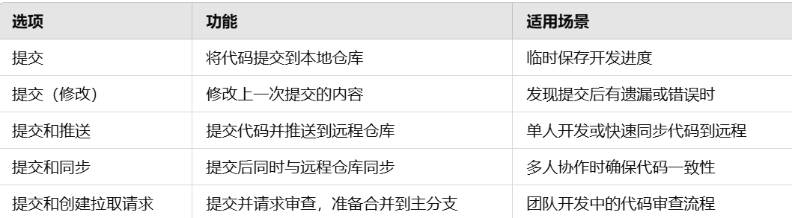
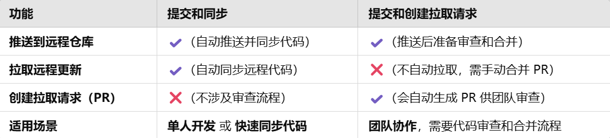
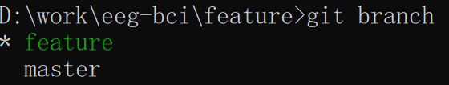

# 信息论
#### 介绍
信息论课程临时代码仓库

tips：     
  分支分为本地分支和远程分支两种。     
  ## 注意：        
  1当执行提交操作后，只是提交到了本地分支，需要推送操作，才能推送到远程（仓库）分支。   
  2推送到远程分支后，就涉及到最重要的操作，代码审查（PULL REQUESTS)和分支合并。   
  3严谨来说，每个人一个分支，推送到远程仓库后，需要在仓库首页申请NEW PULL REQUESTS请求，选择你想要合并的两个分支，同时，右侧可以指定审查人等一系列十分cooperative的操作。   
  **4完成PULL REQUESTS后，分支就被合并到主分支了。**   
    5记得PULL拉取和同步远程仓库代码到本地分支，不然无法同步别人的代码操作。   
  一般main分支是代码最稳定的版本。   
     
        
         
  2024.10.31-zpy

#### 软件架构
代码架构说明

3.  提交代码
> 提交你的代码前，需要申请加入开发人员团队并获取许可。
> 如果你是第一次使用git，需要下载gitbush并创建你的账号并添加邮件地址和SSH密匙；
>
> 添加SSH密匙
> 1. 首先，确认是否安装了openssh，cmd输入`ssh`回车，无错误即可，否则于[https://openssh.org](https://openssh.org)安装，并将其添加至环境变量，重新开启cmd，确认上述输出；

> 2. 如果本地没有密匙`mkdir .ssh`; 查看密匙`cd .ssh; dir`

> 3. 如果没有密匙，`ssh-keygen -t rsa`，一路默认即可，安装至.ssh目录下，并有上图输出；
> 4.  `type id_rsa.pub`查看密匙，复制并添加至git设置中。
>
> pull、push代码
> 1. 在正式操作前需要复制仓库至本地，选择合适的位置作为工作目录（不必为空）`git clone <URL>`，随后可能需要切换分支，`git switch <branch>`，<branch>是分支名，默认为main分支，可以通过`git branch`查看所有分支；
> 2. **!!!非常重要** 的步骤，查看git分支`git branch`，copy下来默认是master (main)，在添加任何代码前，需要更改分支，`git switch <branch>`，类似`git switch develop`，再次查看分支；

> 3. 做出提交前，添加至缓存git add .，添加描述（只会对更改过的文件添加）`git commit -m "<description>"`，随后提交；
> 4. 提交代码`git push -u <URL> <branch>`，branch必须和本地的branch一致，默认为main时可不加，此时刷新浏览器，可见已添加的代码，重复commit和push步骤。
> 5. 下次作任何编辑前，必须先pull仓库更新至最新状态：`git pull origin <branch>`，提交代码前先merge，再操作push。
> 6. 可以通过`git remote -v`查看URL地址，可以使用`origin`替代URL地址，如：`git pull origin`和`git push origin`.
