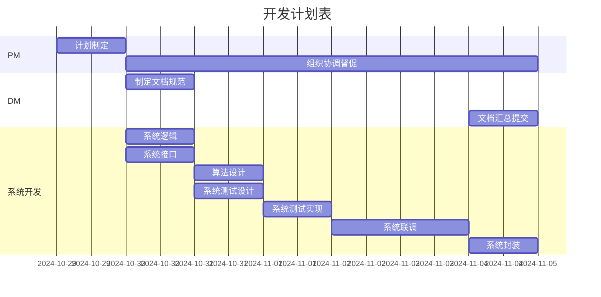
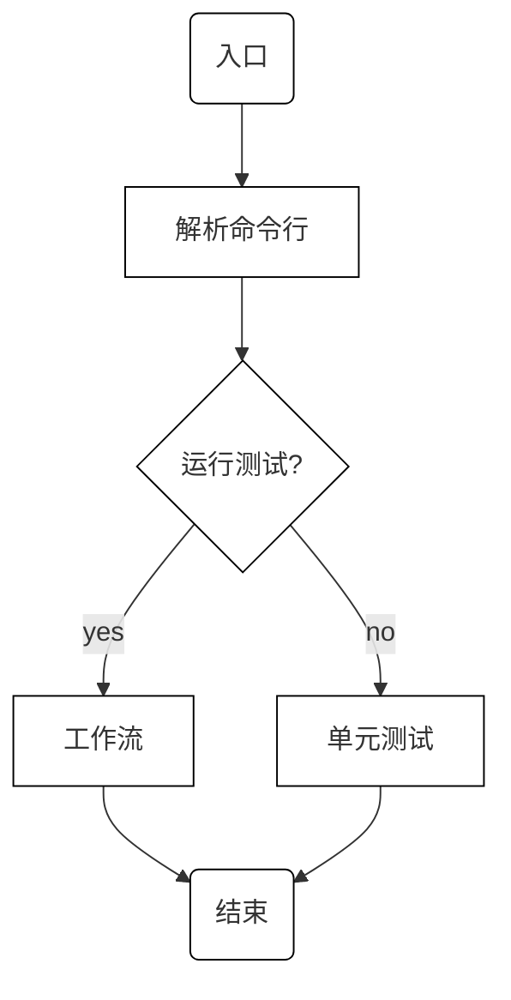
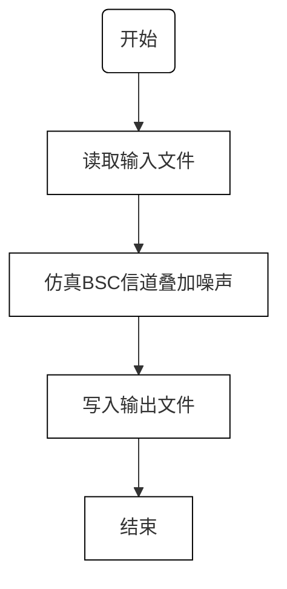
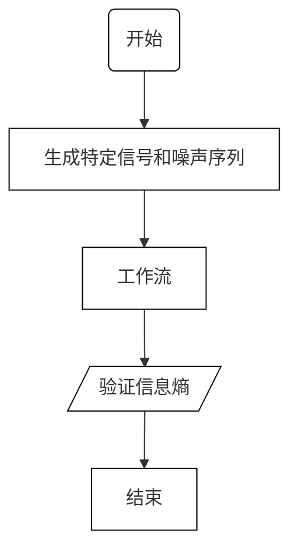

# 系统开发计划

ver: 20241105_1032

## 任务列表

- 系统设计
  - [x] 系统逻辑：流程图（包含模块划分）
  - [x] 接口定义：API定义
- 理论分析
  - [x] 算法设计：原理分析、计算步骤制定
  - [x] 系统测试设计：案例制定、预期结果的理论推导
- 系统实现
  - [x] 模块实现：编程、调试、单元测试
  - [x] 系统联调：连接、调试
  - [x] 系统测试实现：编程、调试
- 系统封装
  - [x] 生成发布版本：可脱离开发环境独立运行的程序
  - [x] 说明文档：安装部署说明、系统使用说明
- 开发管理
  - [x] PM（项目管理）：计划制定、组织协调督促
  - [x] DM（文档管理）：制定文档规范、检查督促各部分文档的编写、文档汇总提交

## 进度计划表（Gantt Chart, 甘特图）

## 系统逻辑

### 入口

### 工作流

### 单元测试

## API定义

### 函数

- 入口
  `main()`

- 解析命令行参数
  `(input_file_name, noise_file_name, output_file_name, do_test) = parse_sys_args()`

- 工作流
  `data = workflow(input_file_name, noise_file_name, output_file_name)`

- 读取输入文件
  `data = read_input(file_name)`

- 仿真BSC
  `output_data = byte_channel(input_data, noise_data)`

- 写入输出文件
  `write_output(output_data, output_file_name)`

- 单元测试
  `test_workflow()`

### 变量

- `input_file_name`: `str`
  输入文件的文件名
- `noise_file_name`: `str`
  噪声文件的文件名
- `output_file_name`: `str`
  输出文件的文件名
- `do_test`: `boolean`
  True: 进行单元测试; False: 不进行单元测试
- `output_data`:  `bytearray`
  二元对称信道传输的数据内容
- `data`: `numpy.array` of `uint8`, one dimentional
  读取的信号序列和噪声二元序列

## 分工

- 曾博升
  - 实验报告，程序使用说明
  - 开发管理：DM
- 张振兴
  - 数据生成：生成参数文件
  - 理论计算：计算九项指标
- 陈金
  - 系统设计：系统逻辑、接口定义
  - 系统实现：系统框架
- 张朋洋
  - 理论分析：算法设计
  - 系统实现：BSC仿真
- 许宏亮
  - 理论分析：系统测试设计
  - 系统实现：系统测试实现
- 陈万弘
  - 项目管理：PM
  - 系统实现：工作流、系统联调
  - 系统封装
