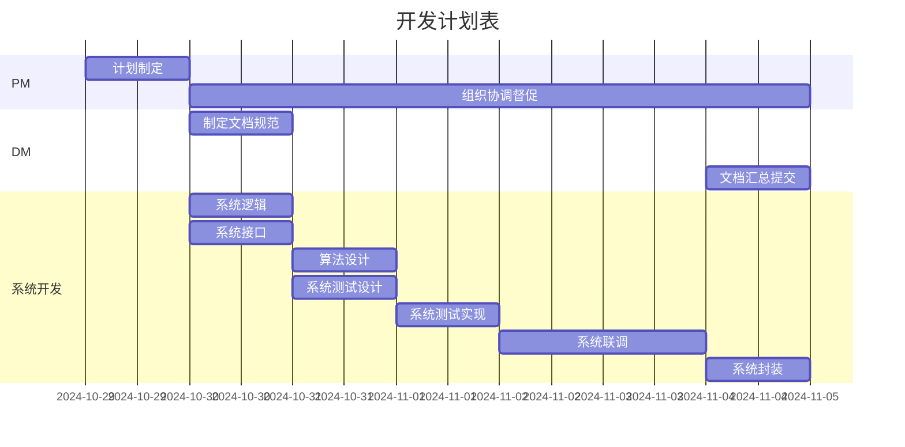
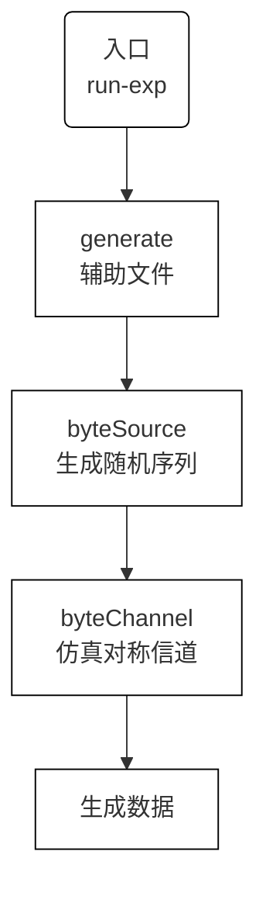
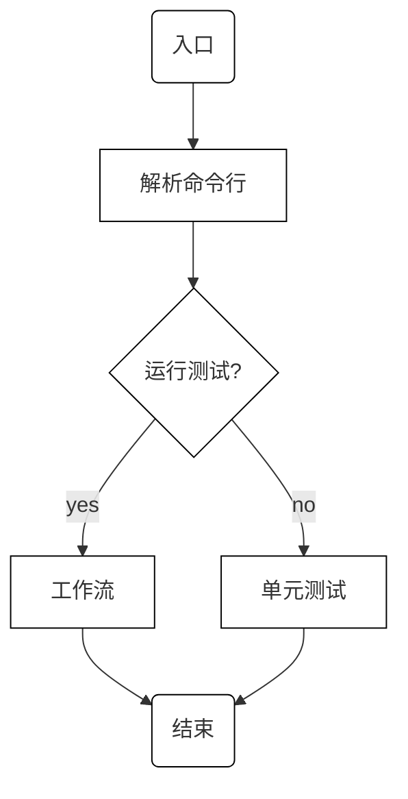
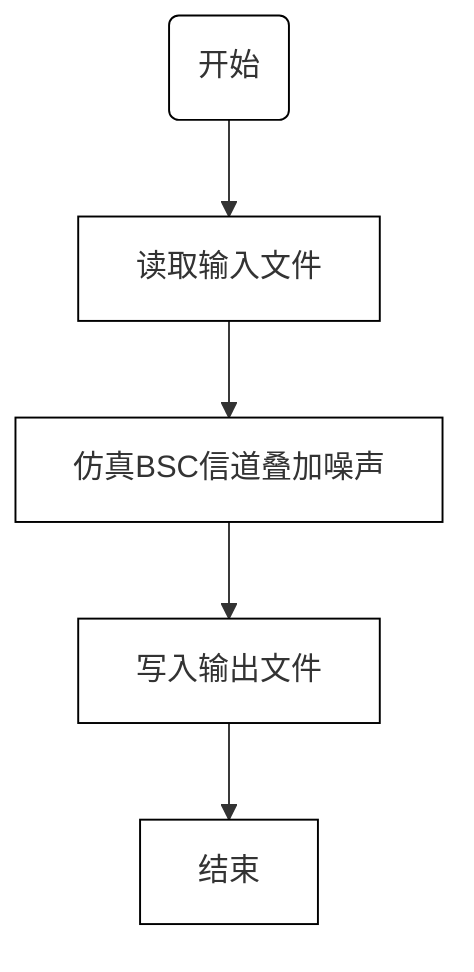
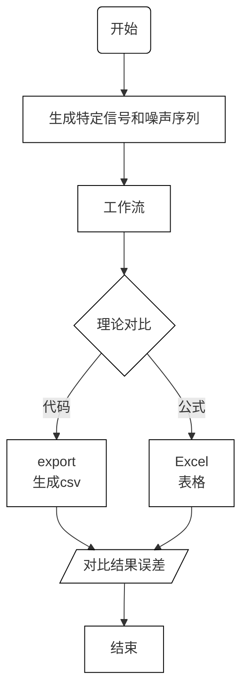
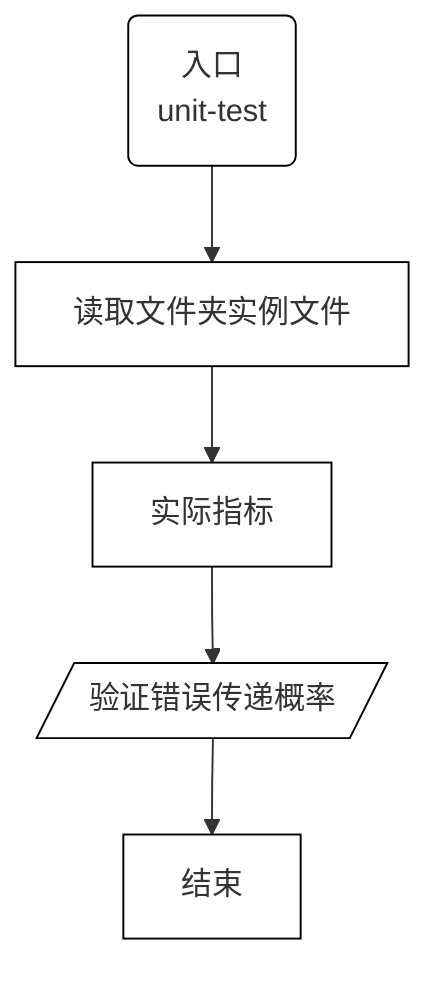

# 系统开发计划

ver: 20241105_1032

## 任务列表

- 系统设计
  - [x] 系统逻辑：流程图（包含模块划分）
  - [x] 接口定义：API定义
- 理论分析
  - [x] 算法设计：原理分析、计算步骤制定
  - [x] 系统测试设计：案例制定、预期结果的理论推导
- 系统实现
  - [x] 模块实现：编程、调试、单元测试
  - [x] 系统联调：连接、调试
  - [x] 系统测试实现：编程、调试
- 系统封装
  - [x] 生成发布版本：可脱离开发环境独立运行的程序
  - [x] 说明文档：安装部署说明、系统使用说明
- 开发管理
  - [x] PM（项目管理）：计划制定、组织协调督促
  - [x] DM（文档管理）：制定文档规范、检查督促各部分文档的编写、文档汇总提交

## 进度计划表（Gantt Chart, 甘特图）

## 系统逻辑

### 系统流程

### byteChannel

### 工作流

### BSC仿真单元测试

### 计算熵指标单元测试

## API定义

### 函数

### 模块功能简介

- 入口  
  **`main(input_path: str, output_path: str, noise_path: str, **kwgs)`**  
  主入口函数，解析输入、输出和噪声文件路径并调用工作流处理。

  - **`input_path`**: 输入文件路径（`str`）  
  - **`output_path`**: 输出文件路径（`str`）  
  - **`noise_path`**: 噪声文件路径（`str`）  
  - **`kwgs`**: 其他命令行参数，如 `message_state` 和 `base_path`。

- 解析命令行参数  
  **`parse_sys_args()`**  
  使用 `argparse` 模块解析命令行参数，包括输入文件、噪声文件、输出文件及其他参数，如目录路径和测试标志等。

  - **返回值**: 包含解析后的命令行参数的字典。

- 处理路径字符串  
  **`path_split(path: str)`**  
  处理传入的路径字符串，支持多路径输入，通过分号（`;`）分割各个路径。

  - **`path`**: 需要处理的路径字符串（`str`）  
  - **返回值**: 一个包含路径列表的可迭代对象。

- 工作流  
  **`work_flow(input_path: str, output_path: str, noise_path: str, **kwgs)`**  
  核心处理流程，主要包括读取输入文件、仿真BSC信道传输、写入输出文件等。

  - **`input_path`**: 输入文件路径（`str`）  
  - **`output_path`**: 输出文件路径（`str`）  
  - **`noise_path`**: 噪声文件路径（`str`）  
  - **`kwgs`**: 其他命令行参数，如 `base_path` 和 `message_state`。

- 读取输入文件  
  **`read_input(input_path: str) -> np.ndarray`**  
  读取文件内容并以 NumPy 数组形式返回，用于读取信源数据。

  - **`input_path`**: 文件路径（`str`）  
  - **返回值**: 一个 NumPy 数组，包含读取的信源数据。

- 仿真BSC  
  **`generate_error_channel(arr: np.ndarray, noise: np.ndarray) -> np.ndarray`**  
  使用给定的噪声序列对输入数据进行比特异或操作，模拟BSC错误传输。

  - **`arr`**: 信源数据（`np.ndarray`）  
  - **`noise`**: 噪声数据（`np.ndarray`）  
  - **返回值**: 通过 BSC 仿真后的数据（`np.ndarray`）。

- 写入输出文件  
  **`write_output(output_path: str, sequence: np.ndarray) -> None`**  
  将生成的符号序列写入输出文件。

  - **`output_path`**: 输出文件路径（`str`）  
  - **`sequence`**: 需要写入的符号序列（`np.ndarray`）

- 快速测试  
  **`quick_test(input_path: str, output_path: str, noise_path: str) -> bool`**  
  快速测试生成符号序列的错误传输概率是否符合预期。

  - **`input_path`**: 输入文件路径（`str`）  
  - **`output_path`**: 输出文件路径（`str`）  
  - **`noise_path`**: 噪声文件路径（`str`）  
  - **返回值**: `True` 如果测试通过，`False` 如果不通过。

- 单元测试  
  **`test_flow(msg_len: int = 100000) -> None`**  
  自动化单元测试流程，生成各种特殊情况的输入文件并进行多次测试。

  - **`msg_len`**: 生成的消息长度（符号数量，`int`）。默认值为 `100000`。

- 生成测试数据  
  **`generate_all_zeros(length: int) -> str`**  
  生成一个全为0的数组，并保存为二进制文件。

  - **`length`**: 生成数组的长度（`int`）  
  - **返回值**: 生成并保存的二进制文件的完整路径（`str`）

  **`generate_half_zeros_half_ones(length: int) -> str`**  
  生成一个一半为0一半为1的数组，并保存为二进制文件。

  - **`length`**: 生成数组的长度（`int`）  
  - **返回值**: 生成并保存的二进制文件的完整路径（`str`）

  **`generate_alternating_zeros_ones(length: int) -> str`**  
  生成一个交替为0和1的数组，并保存为二进制文件。

  - **`length`**: 生成数组的长度（`int`）  
  - **返回值**: 生成并保存的二进制文件的完整路径（`str`）

- 删除临时文件  
  **`delete_temp_file(file_path: str) -> None`**  
  删除临时文件。

  - **`file_path`**: 临时文件路径（`str`）  
  - **返回值**: 无返回值。

### 变量

- `input_file_name`: `str`  
  输入文件的文件名

- `noise_file_name`: `str`  
  噪声文件的文件名

- `output_file_name`: `str`  
  输出文件的文件名

- `do_test`: `boolean`  
  True: 进行单元测试; False: 不进行单元测试

- `output_data`: `bytearray`  
  二元对称信道传输的数据内容

- `data`: `numpy.array` of `uint8`, one dimensional  
  读取的信号序列和噪声二元序列

## 分工

- 曾博升
  - 实验报告，程序使用说明
  - 开发管理：DM
- 张振兴
  - 数据生成：生成参数文件
  - 理论计算：计算九项指标
- 陈金
  - 系统设计：系统逻辑、接口定义
  - 系统实现：系统框架
- 张朋洋
  - 理论分析：算法设计
  - 系统实现：BSC仿真
- 许宏亮
  - 理论分析：系统测试设计
  - 系统实现：系统测试实现
- 陈万弘
  - 项目管理：PM
  - 系统实现：工作流、系统联调
  - 系统封装
