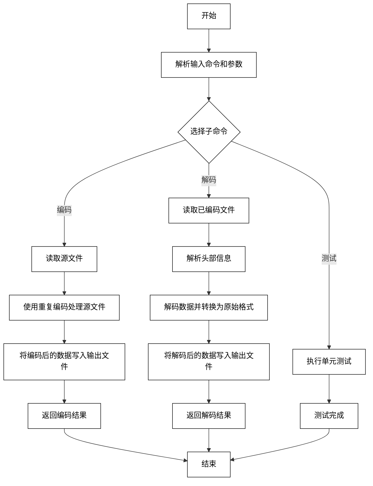
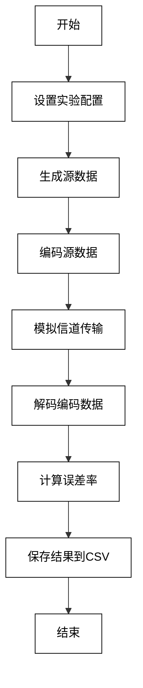

# 无失真信源编码实验报告

## 一、实验基本信息

- **实验名称**: 6.1 有噪信道编码的实现
- **实验目的**:
   通过编写和操作一个重复码编码器，加深对有噪信道编码的理论知识与实际应用的理解。
- **实验软件**:
  - 编程语言: Python
  - 使用的库: numpy：>=1.23.x, <=2.1.x 、bitstring 等
- **实验环境**:
  - 操作系统: Windows 64位
  - Python 版本: >=3.11.x
- **实验成员**:
  - 陈万弘
  - 张朋洋
  - 陈金
  - 许宏亮
  - 张振兴
  - 曾博升

---

## 二、实验原理

### 1. 有噪信道编码原理介绍

**有噪信道编码**是一种通过在信号中加入冗余信息来抵抗噪声干扰的编码技术。其基本目标是提高信号的抗噪声能力，从而在不理想的通信环境中保证信息的正确传输。通常，信道噪声会导致信号失真，导致接收端无法准确恢复原始数据。通过使用适当的编码方法，可以有效地减小误码率，提高数据传输的可靠性。

- **信道编码的基本原理**：
  信道编码是通过增加冗余比特（或符号）来增强数据的鲁棒性。通过选择合适的编码方案（如汉明码、卷积码等），能够使接收端在一定条件下恢复出错误的位，减少误码的发生。
  
- **编码的基本要求**：
  1. **最小化误码率（BER，Bit Error Rate）**：通过冗余设计使得接收端能够在噪声和干扰中尽可能正确地恢复原始信号。
  2. **纠错能力**：一个良好的信道编码不仅能纠正误差，还能尽量不增加冗余比特。
  
- **常见的有噪信道编码方法**：
  1. **块编码**：通过将数据分成固定大小的块进行编码。常见的有汉明码、CRC（循环冗余校验）等。
  2. **卷积编码**：通过使用卷积函数编码输入数据，并利用Viterbi算法等解码技术解码，常用于无线通信和卫星通信等领域。
  3. **Turbo编码和LDPC编码**：现代通信系统中常见的高效编码技术，能够在接近香农极限的条件下工作，广泛应用于4G、5G等无线通信系统中。
  4. **本实验的有噪信道编码方法**：通过对原始信息序列进行重复而实现接收端检错能力的一种简单的纠错编码方式——**循环码**，广泛用于提高数据在信道中的可靠传输。


### 2. 示例代码的理解

#### 1. `demoBitString.py`的大段注释解释

这段代码的注释部分是对程序功能和位打包（bit-packing）操作的简介，主要介绍了位打包在编码与通信中的重要性，以及使用 `bitstring` 模块来实现位打包操作的基本概念和实现方法。

- **位打包的定义与背景**

   **Bit-packing**（位打包）：

   位打包是一个重要的过程，在编码和通信中用于高效地表示一系列值的二进制形式。位打包的目标是：
   - **存储每个值所需的最小位数**：即尽可能减少每个数据值占用的位数。
   - **所有值的位数按顺序存储，没有间隔**：即连续存储每个数据的位表示，没有其他额外的比特间隔。

- **位打包的挑战**

   虽然在数字电路中实现位打包是相对简单的，但在计算机程序中实现则并不容易。主要原因之一是，大多数计算机编程语言中，**字节（8位）是最小的数据单位**。即使某些语言提供了布尔类型（True/False），通常它也会占用一个完整的字节，而不是单个位。

   在编程中实现位打包时，面临几个主要的挑战：
   - **如何将多个值的位合并到一个字节中**（bit-merging）：这意味着将多个不同大小的数据放入一个字节中，例如把多个小整数的二进制位拼接成一个字节。
   - **如何处理值的位跨越多个字节**（bit-splitting）：一个值可能需要占用多个字节（例如，16位的整数），需要正确处理跨越字节的部分。
   - **如何处理最后一个字节，特别是当数据没有填满字节时**（bit-padding）：当所有数据的总位数不是8的倍数时，最后一个字节可能未完全使用，如何填充空余的部分。
   - **如何快速高效地完成这些操作，并且尽量减少内存占用**（performance）：要在速度和内存占用之间找到平衡，特别是对于需要处理大量数据的应用。

- **位打包的实现**

   在计算机程序中实现位打包涉及到一些复杂的操作，因此一些库（如 `bitstring`）为我们提供了方便的接口来处理这些问题。`bitstring` 是一个纯 Python 编写的库，能够帮助我们高效地处理位打包操作。


#### 2. `demo1` - 基本使用示例

- **功能**：
`demo1` 演示了如何创建一个 `BitStream` 对象，如何向 `BitStream` 中添加数据，并将其保存到文件中；然后再从文件中读取该 `BitStream`，并按不同格式（如无符号整数、带符号整数等）解析数据。

- **代码分析**：

```python
def demo1():
    print('##########')
    print('# demo1 - basic usage')
    print('##########')

    # 创建一个空的 BitStream 对象
    A = BitStream()
```

   - `A = BitStream()`：这行代码创建了一个空的 `BitStream` 对象 `A`。`BitStream` 是 `bitstring` 模块提供的一个类，它表示一系列位（bit）的流。

```python
    A.append(Bits(uint=5, length=3))    # 3位无符号整数 5
    A.append('uint:4=2')                # 4位无符号整数 2
    A.append('0b110')                   # 3位无符号整数 6（二进制表示）
    A += Bits(int=-1, length=2)         # 2位带符号整数 -1
```

   - `A.append(Bits(uint=5, length=3))`：这行代码将一个无符号整数 `5`（其二进制为 `101`）作为 3 位数据追加到 `BitStream` 中。
   - `A.append('uint:4=2')`：这行代码使用字符串表示法，表示一个无符号整数 `2`（其二进制为 `0010`），长度为 4 位。
   - `A.append('0b110')`：这行代码直接使用二进制字符串表示法，将 `110` 作为 3 位无符号整数追加到位流中。
   - `A += Bits(int=-1, length=2)`：这行代码将带符号整数 `-1`（二进制表示为 `11`，2 位）追加到位流中。

这时，`A` 中的位流内容为：
```
101 (5) | 0010 (2) | 110 (6) | 11 (-1)
```

接下来，将这些位流内容写入文件：

```python
    FILE_NAME = '_tmp.demo1.dat'
    with open(FILE_NAME, 'wb') as out_file:
        A.tofile(out_file)
```

- `A.tofile(out_file)`：将 `BitStream` 对象 `A` 写入到文件 `_tmp.demo1.dat` 中。这时，文件中保存了一个包含数据的二进制位流。

打印输出当前位流的内容：

```python
    A_bytes = A.tobytes()
    print('A is a BitStream')
    print('  packed from: 5 (uint:3), 2 (uint:4), 6 (uint:3), -1 (int:2)')
    print('      as bits: %s (%d bits)' % (A.bin, A.length))
    print('     as bytes: %s (%d bytes)' % (A_bytes.hex(), len(A_bytes)))
    print('     saved to: %s' % (FILE_NAME))
```

- `A.bin`：打印 `A` 中的位流，以二进制形式显示。
- `A.length`：显示 `A` 中位流的总位数。
- `A.tobytes()`：将 `BitStream` 对象 `A` 转换为字节流，`A_bytes.hex()` 将字节流转为十六进制字符串，`len(A_bytes)` 是字节数。

假设输出结果如下（具体数值会根据实际情况有所不同）：
```
A is a BitStream
  packed from: 5 (uint:3), 2 (uint:4), 6 (uint:3), -1 (int:2)
      as bits: 1010010110011011 (16 bits)
     as bytes: a4d3 (2 bytes)
     saved to: _tmp.demo1.dat
```

接下来，程序从文件中读取位流数据：

```python
    B = BitStream(filename=FILE_NAME)
    B_bytes = B.tobytes()
    print('B is a BitStream')
    print('  read from: %s' % (FILE_NAME))
    print('    as bits: %s (%d bits. It has more bits than A!)' % (B.bin, B.length))
    print('   as bytes: %s (%d bytes)' % (B_bytes.hex(), len(B_bytes)))
```

- `B = BitStream(filename=FILE_NAME)`：从文件中读取位流数据并创建一个 `BitStream` 对象 `B`。
- `B.bin` 和 `B.length` 打印读取后的位流内容和总位数。

然后，程序演示如何从位流 `B` 中读取数据：

```python
    print('Read data from B consecutively')
    print("  B.read('uint:3'): %d" % (B.read('uint:3')))
    print("  B.read('uint:4'): %d" % (B.read('uint:4')))
    print("  B.read('uint:3'): %d" % (B.read('uint:3')))
    print("  B.read('uint:2'): %d (intentionally wrong interpretation)" % (B.read('uint:2')))
    print("       B.bitpos is: %d" % (B.bitpos))
```

- `B.read('uint:3')`：读取 3 位的无符号整数，并打印出来。
- `B.read('uint:4')`：读取 4 位的无符号整数。
- `B.read('uint:3')`：读取 3 位的无符号整数。
- `B.read('uint:2')`：故意读取 2 位数据，但在数据格式不匹配时，程序仍会按其格式读取，可能导致解析错误。

最后，演示位流的切片操作：

```python
    B_slice_start = 2
    B_slice_end = 5
    B_slice = B[B_slice_start:B_slice_end]
    print('B[%s:%s] is a slice of B' % (B_slice_start, B_slice_end))
    print('   as bin: %s' % (B_slice.bin))
    print('  as uint: %d' % (B_slice.uint))
    print('   as int: %d' % (B_slice.int))
    print(' B.bitpos: %d (slicing does not change bitpos)' % (B.bitpos))
```

- `B[B_slice_start:B_slice_end]`：从位流 `B` 中提取出从 `B_slice_start` 到 `B_slice_end` 位置的子流。
- `B_slice.bin`、`B_slice.uint` 和 `B_slice.int`：分别以二进制、无符号整数、带符号整数的格式输出子流的内容。

- **输出示例**：
```
B[2:5] is a slice of B
   as bin: 101
  as uint: 5
   as int: 5
 B.bitpos: 5 (slicing does not change bitpos)
```


#### 3. `demo2` - 固定位宽打包和解包

- **功能**：
`demo2` 演示了如何将一个整数列表按固定位宽打包成位流，并将位流保存到文件中，之后再从文件中读取数据并解包恢复为原始的整数列表。

- **代码分析**：

```python
def demo2():
    print('##########')
    print('# demo2 - pack & unpack')
    print('##########')

    HEADER_BYTES_VALUE_COUNT = 2    # 存储值计数的字节数
    HEADER_BYTES_BIT_LEN = 1        # 存储每个元素位宽的字节数
    HEADER_BYTE_ORDER = 'little'    # 头部的字节序（小端）
    FILE_NAME = '_tmp.demo2.dat'    # 临时数据文件
```

首先定义了一些常量，用于设置文件的头部信息，如每个数据元素的位宽和元素数量。

```python
    A_value_count = 7
    A_value = list(range(A_value_count))
```

- `A_value_count = 7`：表示有 7 个元素需要打包。
- `A_value = list(range(A_value_count))`：生成一个整数列表 `[0, 1, 2, 3, 4, 5, 6]`。

接下来将这些整数按固定的位宽（3 位）打

包成 `BitStream`：

```python
    A_value_bit_width = 3
    A = BitStream()
    for value in A_value:
        A.append(Bits(uint=value, length=A_value_bit_width))
```

- `A.append(Bits(uint=value, length=A_value_bit_width))`：将每个整数 `value` 转换为 3 位的无符号二进制数，并追加到位流 `A` 中。

然后，将数据写入文件，包含头部信息和位流：

```python
    with open(FILE_NAME, 'wb') as out_file:
        out_file.write(bytes([A_value_count, A_value_bit_width]))  # 头部：元素数量和位宽
        A.tofile(out_file)  # 写入数据
```

从文件中读取数据并恢复：

```python
    with open(FILE_NAME, 'rb') as in_file:
        header = in_file.read(2)  # 读取头部
        A_value_count = header[0]  # 元素个数
        A_value_bit_width = header[1]  # 每个元素的位宽
```

根据头部信息创建新的 `BitStream` 对象并解包：

```python
        B = BitStream()
        B.append(BitStream(filename=FILE_NAME)[2:])  # 读取数据
        B_values = [B.read(f'uint:{A_value_bit_width}') for _ in range(A_value_count)]
        print(f'B_values: {B_values}')
```


### 3. 重复码原理

#### 重复码基本原理

重复码（Repetition Code）是通过对原始信息序列进行重复而实现接收端检错能力的一种简单的纠错编码方式，广泛用于提高数据在信道中的可靠传输。其基本原理如下：

##### 3.1 编码过程
重复码的核心思想是通过将每个信息比特重复多次来增加冗余，以抵抗信道中的错误。在编码过程中：
- 每个比特 \( b \) 被重复 \( n \) 次后进行传输。例如，原始比特 \( 1 \) 变为 \( 111 \cdots 1 \)，原始比特 \( 0 \) 变为 \( 000 \cdots 0 \)。
- 若要传输一个比特 \( b \)，通过重复编码，将其变为长度为 \( n \) 的符号序列。例如：
  - \( b = 1 \) 变为 \( 111 \)（当 \( n = 3 \) 时）；
  - \( b = 0 \) 变为 \( 000 \)（当 \( n = 3 \) 时）。

##### 3.2 解码过程
接收端收到通过重复码编码的比特序列后，使用多数投票规则来恢复原始比特：
- 如果接收到的 \( n \) 个比特中，1 的数量大于 0 的数量，则解码为 1；
- 如果接收到的 \( n \) 个比特中，0 的数量大于 1 的数量，则解码为 0；
- 如果 \( n \) 为偶数，且 1 和 0 的数量相等，则无法确定解码结果，通常会产生错误。

举一个简单的例子，接收到的比特序列 \( 111 \) 将被解码为 1，而 \( 110 \) 或 \( 101 \) 也将被解码为 1，表示比特值 1 的可能性较大。

##### 3.3 重复码的纠错能力
重复码的纠错能力取决于重复码的长度 \( n \)，并且纠错能力与重复码的奇偶性有关：
- **若 \( n \) 为奇数**，重复码可以纠正最多 \( \frac{n-1}{2} \) 个错误。例如，当 \( n = 3 \) 时，最多可以纠正 1 个错误；当 \( n = 5 \) 时，最多可以纠正 2 个错误。
- **若 \( n \) 为偶数**，重复码的纠错能力较弱，因为在偶数情况下，无法保证能够区分多于一半的错误。这也是为什么要使用奇数值的 \( n \) 来提高纠错能力的原因。
**因此，在实验要求中明确指出重复码的码字长度，必须是大于2小于10的奇数（2<n<10且n为奇数）。**

##### 总结
重复码通过将比特重复传输并使用多数投票规则解码，从而增加冗余并提高抗错误能力。重复码的纠错能力取决于重复码长度 \( n \)，其纠错能力随着 \( n \) 的增加而提高。适当选择 \( n \) 的值，能有效平衡错误纠正能力和数据冗余，确保在信道中以较高的可靠性传输数据。


### 4. BSC 信道特性

**二元对称信道（BSC）** 是信息理论中的一种理想化信道模型，在之前的实验已经详细的了解过DSC的特性，因此在本次实验中简单总结其主要特性：

- **错误传递概率**：输入比特 \( X \) 在信道传输过程中，以概率 \( p \) 翻转，即：
  \[
  P(Y \neq X) = p, \quad P(Y = X) = 1 - p
  \]
  其中，\( p \) 为信道的错误传递概率。翻转的概率 \( p \) 描述了信道的噪声强度。

##### 信道输出符号分布
在重复码长度为 \( n \) 的情况下，通过 BSC 信道传输时：
- 每个比特的翻转概率为 \( p \)；
- 接收到 \( k \) 个翻转比特的概率为：
  \[
  P(k \text{ flips}) = \binom{n}{k} p^k (1-p)^{n-k}
  \]
  其中，\( \binom{n}{k} \) 是二项式系数，表示从 \( n \) 个比特中选出 \( k \) 个错误比特的组合数。

这个公式表示了接收端在信道传输过程中收到特定错误数量的概率。


### 5. 理论误码率推导

设传输码长为 \( n \)，传输错误概率为 \( p \)。多数投票解码的误码率 \( P_e \) 为：
\[
P_e = \sum_{k=\lceil \frac{n+1}{2} \rceil}^n \binom{n}{k} p^k (1-p)^{n-k}
\]
其中：
- \( \lceil \frac{n+1}{2} \rceil \) 表示纠错能力的临界值，表示需要翻转超过半数的比特时，才会发生解码错误。
- 该公式计算了接收端错误解码的概率，也就是信道误码率。

具体来说：
- 如果接收到的比特中错误的数量 \( k \) 超过了大约 \( n/2 \)（即多数投票失败），则解码会出错。
- 因此，误码率就是当错误数量 \( k \) 大于或等于临界值 \( \lceil \frac{n+1}{2} \rceil \) 时，信号被错误解码的概率。

这个推导公式表明，随着 \( n \) 的增加，重复码的纠错能力也会增强，误码率 \( P_e \) 会下降，但误码率也与信道的错误传递概率 \( p \) 密切相关。当 \( p \) 较大时，重复码的纠错能力会逐渐下降。


#### 5.1 计算重复码长 \( n = 3, 5, 7 \) 的误码率

##### 5.1.1 \( n = 3 \) 的误码率
对于 \( n = 3 \)，多数投票的临界值为 \( \lceil \frac{3+1}{2} \rceil = 2 \)。  
解码错误的条件是：错误比特数 \( k \geq 2 \)。  
误码率为：
\[
P_e = \binom{3}{2} p^2 (1-p) + \binom{3}{3} p^3
\]
得：
\[
P_e = 3p^2 (1-p) + p^3
\]

##### 5.1.2 \( n = 5 \) 的误码率
对于 \( n = 5 \)，多数投票的临界值为 \( \lceil \frac{5+1}{2} \rceil = 3 \)。  
解码错误的条件是：错误比特数 \( k \geq 3 \)。  
误码率为：
\[
P_e = \binom{5}{3} p^3 (1-p)^2 + \binom{5}{4} p^4 (1-p) + \binom{5}{5} p^5
\]
即：
\[
P_e = 10p^3 (1-p)^2 + 5p^4 (1-p) + p^5
\]

##### 5.1.3 \( n = 7 \) 的误码率
对于 \( n = 7 \)，多数投票的临界值为 \( \lceil \frac{7+1}{2} \rceil = 4 \)。  
解码错误的条件是：错误比特数 \( k \geq 4 \)。  
误码率为：
\[
P_e = \binom{7}{4} p^4 (1-p)^3 + \binom{7}{5} p^5 (1-p)^2 + \binom{7}{6} p^6 (1-p) + \binom{7}{7} p^7
\]
即：
\[
P_e = 35p^4 (1-p)^3 + 21p^5 (1-p)^2 + 7p^6 (1-p) + p^7
\]


#### 5.2 具体错误概率的代入计算

##### 5.2.1 错误概率 \( p = 0.2 \)
- \( n = 3 \)：  
  \[
  P_e = 3(0.2)^2 (1-0.2) + (0.2)^3 = 0.104
  \]
- \( n = 5 \)：  
  \[
  P_e = 10(0.2)^3 (1-0.2)^2 + 5(0.2)^4 (1-0.2) + (0.2)^5 = 0.05792
  \]
- \( n = 7 \)：  
  \[
  P_e = 35(0.2)^4 (1-0.2)^3 + 21(0.2)^5 (1-0.2)^2 + 7(0.2)^6 (1-0.2) + (0.2)^7
  \]
  按步骤计算可得 \( P_e \approx 0.033344 \)。

##### 5.2.2 错误概率 \( p = 0.5 \)
当 \( p = 0.5 \) 时，符号传输是随机的，解码过程无法利用任何冗余信息，因此误码率趋近于 \( 0.5 \)，即：
  \[
  P_e = 0.5
  \]

##### 5.2.3 错误概率 \( p = 0.7 \)  
按同样公式代入计算得各 \( P_e \)，数值分别约为：
- \( n = 3 \)：\( P_e \approx 0.784 \)；
- \( n = 5 \)：\( P_e \approx 0.83692 \)；
- \( n = 7 \)：\( P_e \approx 0.873964 \)。
当 \( p = 0.7 \) 时，重复码的效果较差，解码错误的概率增加。


#### 5.3 观察、总结
**1**. 随着重复码长度 \( n \) 的增加，误码率 \( P_e \) 显著下降

重复码的主要优势在于其能够通过增加冗余来提高信号的可靠性。当信道中的噪声引起错误时，冗余比特帮助接收端通过多数投票规则正确恢复原始比特。误码率 \( P_e \) 是指在解码过程中，由于错误传输导致的错误解码的概率。

对于重复码，当码长 \( n \) 增加时，接收到的比特中出现错误的次数需要达到一定数量才能导致解码错误。随着 \( n \) 增加，接收到的比特中需要出现更多的错误才会导致误解码，因此误码率 \( P_e \) 会显著下降。

数学上，误码率 \( P_e \) 可以通过以下公式计算：
\[
P_e = \sum_{k=\lceil \frac{n+1}{2} \rceil}^n \binom{n}{k} p^k (1-p)^{n-k}
\]
其中：
- \( n \) 是重复码的长度；
- \( p \) 是信道的错误传递概率；
- \( k \) 是发生错误的比特数量，解码错误发生在 \( k \geq \lceil \frac{n+1}{2} \rceil \) 时。

随着 \( n \) 增加，\( k \) 的阈值也增加，导致误解码的概率变小，因此误码率 \( P_e \) 随着 \( n \) 的增加而显著下降。

实验只是在重复码长 2<n<10 时进行总结，但根据理论推导，重复码的长度 n 越长，接收到的比特序列中，错误的比特数需要达到的临界值也会增加，纠错能力依然能够提高，但是随着冗余数据的增加，即使信道出现错误，接收到的比特中需要出现更多的错误才能导致解码错误，也就是可能会导致误码率增大，并且当 n 非常大时，大量冗余比特使得每个比特的传输成本增加。

**2**. 当信道错误概率 \( p \) 较大（\( p = 0.7 \)），重复码的纠错能力显著降低

重复码的效果与信道的错误概率 \( p \) 密切相关。信道错误概率 \( p \) 表示在信号传输过程中每个比特被翻转的概率。当 \( p \) 较大时，即信道噪声较强，重复码的纠错能力会显著降低。

- **小 \( p \) 值**：当 \( p \) 较小（例如 \( p = 0.2 \)），重复码可以有效地利用多数投票来纠正传输错误，从而显著降低误码率 \( P_e \)。
- **大 \( p \) 值**：当 \( p \) 较大（例如 \( p = 0.7 \)），每个比特被翻转的概率增加，使得解码时即使是重复码的多数投票规则也难以正确恢复原始比特。此时，重复码的纠错能力变差，误码率会显著上升。

对于 \( p = 0.7 \)，重复码的冗余数据虽然能提高纠错能力，但信道本身的高噪声使得多数投票规则无法有效纠正错误。因此，随着 \( p \) 增加，重复码的纠错能力逐渐失效。


**3**. 当 \( p = 0.5 \) 时，重复码不会带来改进，因为此时的信号完全随机

当信道错误概率 \( p = 0.5 \) 时，信道中的比特传输实际上是完全随机的：
- 如果 \( p = 0.5 \)，每个比特有 50% 的概率翻转和 50% 的概率保持不变。换句话说，接收端对接收到的比特无法做出任何有效的判断，因为接收的信号对原始比特的依赖性完全丧失。
- 在这种情况下，无论使用多长的重复码，重复的比特序列与原始信息之间的相关性都会丧失。即使使用 \( n = 3 \) 或更大的重复码，解码结果仍然是随机的。

这种情况下，重复码的冗余并没有起到实际作用，因为信号的传输完全是随机的，不能有效地利用多数投票规则进行纠错,重复码并不会改善误码率。

---


## 三、实验过程

### 1. 重复码编/解码程序实现
在本实验中，我们基于`demoBitString.py`，实现了一个简单的重复码编/解码程序。重复编码是一种通过对每个输入符号进行重复编码以增强信号的可靠性的方法。

#### 1.1 编码过程

重复码的编码过程将每个输入符号扩展为多个相同的符号。具体步骤如下：

1. **输入验证**：
   - 编码长度 `LEN` 必须是一个奇数，且满足 `2 < LEN < 10`。如果输入的 `LEN` 不符合要求，则程序会抛出异常并终止执行。

2. **读取输入文件**：
   - 输入文件通过 `numpy.fromfile` 读取为二进制数据，转换为 `np.uint8` 类型的数组。

3. **重复编码**：
   - 使用 `np.unpackbits` 将字节数据展开为比特，并通过 `np.repeat` 进行重复编码。重复次数由用户提供的编码长度 `LEN` 决定。即

| LEN    | source length | codeword sequence |
| ------ | ------------- | ----------------- |
| 1 byte | 4 bytes       | multiple bytes    |

4. **标头填0增冗余**：
   - 如果编码后的比特数不是8的倍数，则使用 `np.pad` 填充零位，使数据的大小符合字节对齐的要求。之后，使用 `np.packbits` 将比特重新打包为字节。增加 Header 的冗余信息（LEN 和源长度）使解码器能够更可靠地获取关键信息，从而降低 出错概率。即使在传输过程中部分数据发生错误，固定的 Header 提供的结构信息有助于解码器定位错误并部分修复。


5. **保存编码数据**：
   - 将编码后的数据写入输出文件，首先写入编码长度（1字节），然后写入源数据的长度（4字节），接着写入编码后的数据。

通过这些步骤，原始输入数据被转换为重复编码的形式，并保存到输出文件中。

#### 1.2 解码过程

重复码的解码过程通过对每组重复的比特进行投票来恢复原始数据。解码过程的具体步骤如下：

1. **读取编码文件**：
   - 使用 `np.fromfile` 读取编码文件的内容，获取编码长度和源文件长度等信息。

2. **解析编码数据**：
   - 从编码文件中提取编码长度、消息长度和编码后的数据。

3. **恢复原始数据**：
   - 使用 `np.unpackbits` 将编码数据展开为比特，并按照编码长度对每组比特进行重组。每组比特中的1的数量若超过编码长度的一半，则判定为1，否则为0。

4. **写入解码数据**：
   - 将解码后的比特数据重新按字节打包，使用 `np.packbits` 并保存到输出文件中。

解码后，输出的文件内容应与原始输入文件相同。

#### 1.3 编码和解码程序的命令行接口

该程序通过命令行进行操作，支持两种主要的子命令：`encode`（编码）和 `decode`（解码）。命令格式如下：

- **编码命令**：
  ```bash
  python repetitionCoder.py encode <LEN> <INPUT> <OUTPUT>
  ```
  其中，`<LEN>` 为编码长度（一个奇数，2 < `LEN` < 10），`<INPUT>` 为输入文件路径，`<OUTPUT>` 为输出文件路径。

- **解码命令**：
  ```bash
  python repetitionCoder.py decode <INPUT> <OUTPUT>
  ```
  其中，`<INPUT>` 为编码文件路径，`<OUTPUT>` 为解码输出文件路径。

- **测试命令**：
  ```bash
  python repetitionCoder.py -t
  ```
  该命令用于运行程序的单元测试，确保程序的各个功能正常。

通过这些命令，用户可以方便地对文件进行编码和解码操作。

#### 1.4 编码和解码的核心实现

**编码函数 `encode`**：
该函数首先验证编码长度是否符合要求，然后读取输入文件并对每个字节进行重复编码。编码过程使用了 `np.unpackbits` 展开每个字节为比特，随后通过 `np.repeat` 实现重复编码。最后，经过必要的填充和字节对齐后，将编码结果写入输出文件。

**解码函数 `decode`**：
解码函数首先从文件中读取编码信息，并解析出编码长度和消息长度。然后，通过 `np.unpackbits` 展开编码数据，依据重复码的特性对每组比特进行投票，恢复原始数据。解码后的数据重新按字节打包并输出。

#### 1.5 程序运行示例

1. **编码示例**：
   ```bash
   python repetitionCoder.py DMS.p=0.2.len=3.dat DMS.p=0.2.RC.en.len=3.dat
   ```
   此命令将 `DMS.p=0.2.len=3.dat` 文件进行重复编码，并将编码后的结果保存为 `DMS.p=0.2.RC.en.len=3.dat`。

2. **解码示例**：
   ```bash
   python repetitionCoder.py DMS.p=0.2.RC.en.len=3.dat DMS.p=0.2.RC.de.len=3.dat
   ```
   此命令将对 `DMS.p=0.2.RC.en.len=3.dat` 文件进行解码，并将解码结果保存为 `DMS.p=0.2.RC.de.len=3.dat`。

通过这两个示例，可以验证程序在编码和解码过程中是否能够正确处理输入和输出文件。


### 2. 误码率计算程序实现

本实验中通过编写一个程序，计算重复编码文件的误码率，并将结果输出到CSV文件中。误码率用于衡量编码后的数据与原始数据之间的差异，在数据传输与存储中具有重要意义。具体实现步骤如下：

#### 2.1 程序功能概述

本程序接受两个文件作为输入，并计算它们之间的误码率（即比特差异率）。输入文件分别为原始文件和经过重复编码后的文件。程序通过比较这两个文件的数据，计算出它们在比特级别上的差异，并将结果输出到一个CSV文件中。每一行CSV文件包含文件对、误码率等信息。

#### 2.2 程序输入

程序通过命令行接收三个参数：
- `INPUT1`：原始文件路径；
- `INPUT2`：解码后的文件路径（或编码文件路径）；
- `RESULT`：存储计算结果的CSV文件路径。

另外，还支持一个 `-t` 参数，用于运行单元测试。

#### 2.3 主要函数

- **`compare_file` 函数**：
  该函数是误码率计算的核心。其主要功能是比较两个文件的内容，并计算比特差异：
  1. **文件读取**：
     使用 `np.fromfile` 从磁盘加载两个文件的数据。
  2. **文件大小比较**：
     如果两个文件大小不同，程序会打印警告，并仅比较较小文件的部分内容。
  3. **比特差异计算**：
     使用 `np.unpackbits` 将文件内容转换为比特序列，然后通过按位异或（XOR）操作计算不同的比特数。最终将不同的比特数除以总比特数，得到误码率。
  4. **结果保存**：
     将计算的误码率保存到指定的CSV文件中。

- **`path_split` 函数**：
  用于解析输入文件路径，支持多个路径输入，路径之间以分号 `;` 分隔。

- **`main` 函数**：
  负责解析命令行参数，调用 `compare_file` 函数处理文件对，并输出结果。

#### 2.4 程序运行流程

1. **命令行输入**：
   用户通过命令行输入文件路径，运行程序进行误码率计算。示例命令：
   ```bash
   python calcErrorRate.py DMS.p=0.2.len=3.dat DMS.p=0.2.RC.de.len=3.dat result.csv
   ```
   上述命令计算 `DMS.p=0.2.len=3.dat` 和 `DMS.p=0.2.RC.de.len=3.dat` 文件的误码率，并将结果保存到 `result.csv`。

2. **文件读取**：
   程序从指定路径读取原始文件和编码后的文件。

3. **误码率计算**：
   比较两个文件的比特，统计差异比特数，并计算误码率。

4. **结果保存**：
   将每次计算的结果（包括文件路径和误码率）保存到CSV文件中。

#### 2.5 误码率计算公式

误码率（Bit Error Rate, BER）是指接收信号中错误比特占总比特数的比例，计算公式如下：

\[
\text{Error Rate} = \frac{\text{Number of Different Bits}}{\text{Total Number of Bits}}
\]

- **Number of Different Bits**：通过比特异或操作计算的不同比特的数量。
- **Total Number of Bits**：文件中比较的总比特数。

#### 2.6 CSV 结果格式

计算结果保存为CSV文件，每一行包含以下字段：
- `file1_path`：原始文件路径。
- `file2_path`：解码文件路径（或编码文件路径）。
- `error_rate`：误码率。

CSV文件中的一行示例：
```
input.dat, decoded_output.dat, 0.0125
```

#### 2.7 程序运行示例

1. **运行误码率计算**：
   ```bash
   python calcErrorRate.py input.dat decoded_output.dat result.csv
   ```
   该命令将比较 `input.dat` 和 `decoded_output.dat` 两个文件，计算误码率并将结果保存到 `result.csv`。

2. **测试命令**：
   ```bash
   python calcErrorRate.py -t
   ```
   该命令用于运行程序的单元测试，检查程序各个部分是否正确工作。

#### 2.8 错误处理

- **文件不存在**：如果输入的文件路径无效或文件不存在，程序会抛出 `FileNotFoundError` 错误。
- **文件大小不同**：如果两个文件的大小不一致，程序会发出警告并仅比较较小文件的内容。
- **空文件**：如果其中一个文件为空，程序会发出警告并计算误码率为0。

### 3. 单元测试实现
#### 3.1 **重复编码的测试**（`TestRepetitionCoder` 类）

- **test_encode_repetition_valid**：测试正常参数下的编码功能，确保编码结果正确。
- **test_encode_repetition_invalid_length**：测试非法长度参数（小于3或大于9），确保抛出 `ValueError`。
- **test_encode_empty_file**：测试空文件编码，验证编码后文件是否为空且大小正确。
- **test_decode_repetition_valid**：测试合法编码文件的解码，确保解码后文件内容正确。
- **test_decode_empty_file**：测试空编码文件的解码，确保程序能够正确处理。
- **test_decode_invalid_length**：测试非法编码文件的解码，确保抛出 `TypeError`。

#### 3.2 **误码率计算的测试**（`TestCalculateErrorRate` 类）

- **test_identical_files**：测试两个相同文件的误码率，确保为 `0.0`。
- **test_different_files**：测试两个完全不同的文件，误码率应为 `1.0`。
- **test_partial_difference**：测试部分不同文件，检查误码率计算是否正确。
- **test_file_size_mismatch**：测试文件大小不一致的情况，确保程序处理异常。
- **test_file_not_exist**：测试无效文件路径的情况，确保抛出 `FileNotFoundError`。
- **test_empty_files**：测试空文件，确保误码率为 `0.0`，并防止除零错误。

#### 总结

- 测试全面涵盖了常见的编码解码场景以及误码率计算。
- 通过不同的文件内容、大小和路径验证程序的健壮性。
### 4. 实验流程

重复码编/解码程序`repetitionCoder.py`逻辑流程如下：



运行批处理程序`run-exp.cmd`单元实验启动




## 四、实验结果及分析

### 1. 误码率理论与实验结果对比
实验得到的数据以及理论值结果如下表所示：
| 处理方式                             | 实验        | 理论    |
|--------------------------------------|-------------|---------|
| unit-data\DMS.p=0.2.RC.de.len=3.dat  | 0.10366207  | 0.104   |
| unit-data\DMS.p=0.5.RC.de.len=3.dat  | 0.499775466 | 0.5     |
| unit-data\DMS.p=0.7.RC.de.len=3.dat  | 0.78533144  | 0.784   |
| unit-data\DMS.p=0.2.RC.de.len=5.dat  | 0.058175918 | 0.05792 |
| unit-data\DMS.p=0.5.RC.de.len=5.dat  | 0.499674064 | 0.5     |
| unit-data\DMS.p=0.7.RC.de.len=5.dat  | 0.837010372 | 0.83692 |
| unit-data\DMS.p=0.2.RC.de.len=7.dat  | 0.032760169 | 0.033344|
| unit-data\DMS.p=0.5.RC.de.len=7.dat  | 0.500956078 | 0.5     |
| unit-data\DMS.p=0.7.RC.de.len=7.dat  | 0.873341349 | 0.873964|

实验结果和理论结果的误码率（error rate）之间的对比如下：

1. **实验与理论整体趋势**：
   - 实验数据整体与理论值趋势一致，表明在**不同误码率参数 \( p \) 和数据长度 \( len \)** 下，实验基本验证了理论模型的正确性。
   - **p=0.5**：实验误码率与理论值最接近，偏差几乎为零，说明在这种情况下，信道的理想二元对称性和独立性假设基本成立。
   - **p=0.2 和 p=0.7**：偏差相对较大，尤其是在 \( len=5 \) 和 \( len=7 \) 的情况下，实验误码率偏高或偏低。


2. **主要误差来源总结**：

- (1) **有限样本效应**：
   - 当 \( len=7 \) 时，尽管数据长度增加，但实际样本数仍然有限，导致误码率的统计估计不够稳定。
   - **误码率低的情况（p=0.2）**：误码率较小，误差容易受样本量不足的影响。
   - **误码率高的情况（p=0.7）**：高误码率条件下，误差会因为某些数据块噪声分布的随机性而被低估。

- (2) **算法实现误差**：
   - 计算中可能存在浮点数舍入误差，尤其是在 \( p=0.7 \) 这种高误码率条件下，概率分布的近似和解码算法误差更加明显。
   - 数据边界条件的处理细节也可能影响高误码率实验的准确性。


- (3) **随机性因素**：
   - 尤其在长数据块 \( len=5, 7 \) 下，信道噪声的随机波动可能导致误码率的不稳定，增加与理论值之间的偏差。


3. **观察重点**：
   - **p=0.5** 的实验结果准确性最高，表明算法和实验系统在中等误码率下表现最佳。
   - **p=0.2 和 p=0.7** 下偏差加大，值得进一步关注数据长度和信道特性对误码率计算的影响。
   - 长数据块情况下（特别是 \( len=7 \)），有限样本效应和随机波动的影响更显著。


### 2. **改进建议**：
实际上当前的理论误码率和实验得到的误码率误差并不是很大，但这里仍然提供了两个思路，使实验的结果更加接近理论值。
   - **增加样本量**：通过扩展数据文件的大小，减小有限样本效应对误码率统计的影响。
   - **改进算法实现**：优化浮点运算精度和边界条件的处理，减少实现误差。

综上所述，误码率实验与理论值之间的偏差主要受到**有限样本效应**、**算法实现误差**和**随机性因素**的影响。尤其在 **p=0.7** 和长数据块 \( len=7 \) 的情况下，误差相对较大。


### 3. 有噪信道传输改进思路 

这里已经使用了标头补0冗余的方式，另外这里也有另外的增冗余方案。

#### 3.1 无噪、有噪信道分离传输（使用中）
   - **背景**：在仿真信道传输过程中，将随机噪声数据对应于标头信息的位置采取补零操作，使数据长度对齐，并防止了标头信息的丢失，实际上实现了标头和有效载荷的分离传输：标头信息传输中的噪声熵和损失熵为零，为无损信道；有效载荷则依旧通过二元有噪信道传输。这种设计是保证数据在传输过程中可靠性的关键之一。为了避免标头信息在有噪信道中丢失**导致译码错误**等问题，目前采用**配置信道、数据信道分离**的方式。具体而言，采用**补零**方式填充二元信道的错误传输仿真数据上，以确保标头信息的完整性和数据信道的独立性，使实验误码率计算误差位于有效范围内。
   - **实现方式**：通过在错误传输仿真数据前补充零位，防止标头信息错误传输，可以避免标头损坏而导致译码意外失败，确保实验程序可以正确运行。
   - **效果**：这种方法将标头配置信息传输信道与数据有噪传输信道分离，并且在实际工程中，低数据传输率的无噪信道传输是可实现的，表明这种分离式设计可以提升译码可靠性。

#### 3.2 标头固定N倍重复编码
   - **背景**：在高噪声信道环境中，重复编码是一种经典的提高数据可靠性的技术。标头定义了数据的重复次数和原始数据长度，但是标头本身的信息也有可能在有噪信道传输中丢失，导致数据的译码方法丢失。在信道错误传输率远小于0.5的情况下，可以采用标头部分**固定N倍重复编码**的策略，比如N=9，这意味着标头信息中每一比特会被重复9次进行编码。
   - **实现方式**：发送端将标头数据中的每个比特重复9次，在传输过程中，即使部分比特由于噪声或干扰出现错误，接收端依然能够通过多数投票机制恢复正确的标头信息。标头的九倍重复编码提供了极高的可靠性，能够有效降低信道噪声引起的错误。
   - **效果**：这种方法由于重复编码的冗余度较高，即便在信号受到较为严重干扰的情况下，标头部分的错误也能被成功纠正，提供了可靠的保护能力。
   
#### 3.3 增强数据冗余设计
   - **背景**：虽然标头部分的冗余已经有效降低了误码率，但整个数据的传输仍可能受到噪声的影响。为了进一步提升整体数据传输的可靠性，考虑增强整个数据流的冗余设计。
   - **改进方式**：
     1. **组合更强的纠错码**：在标头之外的实际数据部分，除了采用基本的重复编码外，可以结合其他强纠错码，如 **LDPC 码** 或 **Turbo 码**，这些纠错码在高噪声环境下具有更高的纠错能力。
     2. **更复杂的投票机制**：基于现有的重复编码，可以采用**加权投票机制**，为不同的比特分配不同的权重，权重值可以根据信道的噪声水平进行调整。通过智能地调整每个比特的权重，可以提高纠错精度，进一步减少误码率。
     3. **动态调整冗余度**：尽管接收端无法反馈，但发送端可以基于信道的变化预设不同的冗余策略。例如，在信道质量较差时增加冗余度，使用更多的重复编码；而在信道质量较好的情况下则减少冗余度，提高传输效率。
   
此外，如果接收端可以做出反馈，实际上还有更加优化的方案。


#### 3.4 接收端反馈优化
如果接收端能提供反馈，则可以实现更加智能的优化：
- **动态调整冗余**：根据信道质量实时调整编码冗余。
- **自适应投票机制**：根据信道反馈动态调整投票阈值和加权投票，提升解码准确度。
- **自动重传**：在误码率较高时，通过反馈请求重传错误数据块，减少无效传输。

通过这些优化，系统可以根据不同的信道环境，提升传输的可靠性和效率。