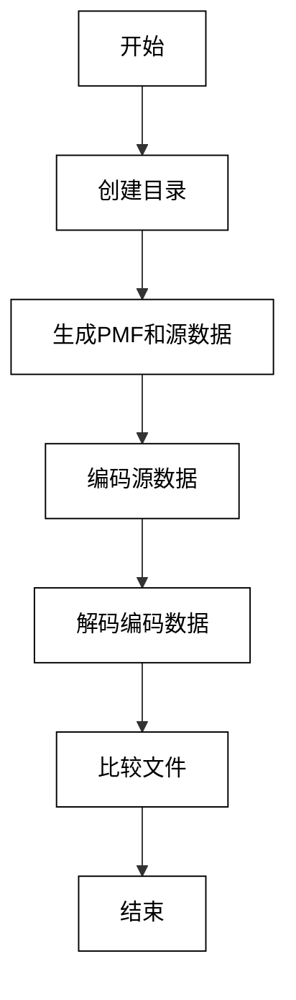

# 无失真信源编码实验报告

## 一、实验基本信息

- **实验名称**: 8.1 无失真信源编码的实现
- **实验目的**:
  1. 实现基于霍夫曼编码的无失真信源编码程序。
  2. 比较不同概率分布下的信源编码效果。
  3. 计算并对比理论上无失真信源编码的压缩极限与实际编码结果。
- **实验软件**:
  - 编程语言: Python
  - 使用的库: numpy、argparse 等
- **实验环境**:
  - 操作系统: Windows 64位
  - Python 版本: 3.x
  - 必要工具: 7z 压缩工具
- **实验成员**:
  - 陈万弘
  - 张朋洋
  - 陈金
  - 许宏亮
  - 张振兴
  - 曾博升


## 二、实验原理

### 1. 无失真信源编码简介

无失真信源编码（Lossless Source Coding）是一种数据压缩方法，在压缩过程中不会丢失任何信息，解码后的数据与原数据完全一致。霍夫曼编码是一种常用的无失真编码方法，它基于符号的频率构建编码方案，通过为频率较高的符号分配短的编码，而为频率较低的符号分配长的编码，从而实现数据压缩。

### 2. 霍夫曼编码

霍夫曼编码是一种最优前缀编码算法，基于符号频率的概率分布来生成最小平均码长的编码表。该编码方式具有以下特点：

- **前缀性质**：任何一个符号的编码都不是另一个符号编码的前缀。
- **最优性**：根据符号的频率分布生成的编码，使得数据的总码长最短。

#### 霍夫曼编码的构建过程

1. **构建最小堆**: 
   - 将每个符号和其频率作为节点，插入最小堆中。每个节点包含符号和其频率。
   
2. **合并最小频率的节点**:
   - 从最小堆中弹出两个频率最小的节点，并将它们合并成一个新的节点。新节点的频率为两个子节点的频率之和，且新节点的左子树为一个符号，右子树为另一个符号。
   
3. **重复合并**:
   - 重复步骤 2，直到堆中只剩一个节点，这个节点代表着整个霍夫曼树。

4. **生成编码表**:
   - 从霍夫曼树的根节点开始，向下遍历树的每条路径（左子树为 '0'，右子树为 '1'），为每个符号分配唯一的二进制编码。

#### 解码过程

- 在解码时，使用已构建好的霍夫曼树，根据编码的每一位决定走树的左子树或右子树，直到遇到叶子节点，返回对应的符号。
  
### 3. 实验实现

#### `encode` 命令

- **功能**: 对给定的输入信源文件进行编码，生成压缩后的编码文件。
- **输入**:
  - `PMF`: 概率质量函数文件，指定符号的概率分布。
  - `INPUT`: 要编码的源数据文件。
- **输出**:
  - `OUTPUT`: 编码后的输出文件，包含编码信息和数据。

#### `decode` 命令

- **功能**: 对给定的编码文件进行解码，恢复原始的源数据。
- **输入**:
  - `INPUT`: 编码后的文件。
- **输出**:
  - `OUTPUT`: 解码后的文件，理论上应与 `encode` 输入的文件一致。


### 3.1 编码过程

编码过程通过 `encode` 命令实现，其主要流程如下：

1. **读取源数据**：
   - 从输入文件中读取源数据，数据格式为 `uint8`，即每个符号占 1 字节。

2. **读取概率质量函数（PMF）**：
   - 读取指定的概率质量函数文件，构建符号的概率分布字典。

3. **构建霍夫曼编码器**：
   - 使用概率分布构建霍夫曼编码器。霍夫曼编码通过最优的编码方式对源数据进行压缩，生成对应的编码。

4. **生成编码文件**：
   - 获取编码器的码本，构建包含编码信息的文件头。文件头包括符号的数量、源数据的长度以及每个符号的编码信息。
   - 将编码后的数据和文件头一起写入输出文件。

5. **输出**：
   - 输出编码后的文件，包含了源数据的压缩版本以及相关的编码信息，方便解码过程使用。


### 3.2 解码过程

解码过程通过 `decode` 命令实现，主要包括以下步骤：

1. **读取编码文件**：
   - 打开编码后的文件，首先读取文件头部信息，获取符号计数、源数据长度和每个符号的编码信息。

2. **构建解码器**：
   - 根据文件头中的编码信息，构建霍夫曼解码器，解码器会使用该信息来正确解码数据。

3. **解码数据**：
   - 使用霍夫曼解码器对编码后的数据进行解码，恢复源数据。

4. **输出解码后的文件**：
   - 将解码后的数据写入输出文件，理论上应与编码前的源数据一致。


### 3.3 文件比较

为验证编码和解码过程的正确性，提供了 `compare` 命令来比较源文件和解码后的文件是否一致：

1. **读取两个文件的数据**：
   - 读取源文件和解码文件的数据，按字节进行比较。

2. **比较文件大小**：
   - 如果源文件和解码文件大小不同，输出警告，并比较前几个字节。

3. **统计差异**：
   - 比较源文件和解码文件每个字节的差异，统计不同字节的数量。

4. **输出结果**：
   - 输出文件中的差异字节总数，检查是否存在编码或解码过程中的误差。


### 3.4 流程逻辑

整个程序的流程可以分为以下几个关键步骤：

1. **命令行解析**：
   - 使用 `argparse` 解析输入的命令和参数，支持 `encode`、`decode` 和 `compare` 子命令。

2. **编码过程**：
   - 对于 `encode` 命令，程序读取源数据和概率质量函数文件，构建霍夫曼编码器，生成压缩后的编码文件，并计算压缩比。

3. **解码过程**：
   - 对于 `decode` 命令，程序读取编码文件，解析文件头部信息，使用霍夫曼解码器解码数据，恢复源数据。

4. **文件比较**：
   - 对于 `compare` 命令，程序比较源文件和解码文件，统计差异字节，确保编码和解码的正确性。

5. **测试**：
   - 提供了 `test` 子命令用于进行单元测试，验证程序的各项功能是否正常工作。


### 4. 理论分析

#### 4.1 无失真信源编码的理论基础

无失真信源编码的核心依据是 **信源编码定理**，该定理指出：
> 一个具有熵 \( H(X) \) 的离散无记忆信源，在无失真的情况下，可以将每个符号压缩到平均长度为 \( H(X) \) 比特，而不丢失信息。其压缩后的码字长度的期望值不能低于熵 \( H(X) \)。

- **下限**：码字的平均长度 \( L \) 满足
  \[
  L \geq H(X)
  \]
- **上限**：存在一种编码方式，使得平均码长接近 \( H(X) \)，即
  \[
  L \to H(X) \quad \text{当 } N \to \infty
  \]
  其中 \( N \) 是消息的长度。

#### 4.2 信息熵与最小文件尺寸

信息熵 \( H(X) \) 衡量了信源的不确定性，越大表示信息越难以压缩。它的数学表达式为：
\[
H(X) = -\sum_{i=1}^n P(x_i) \log_2 P(x_i)
\]
其中 \( P(x_i) \) 是信源符号 \( x_i \) 出现的概率，\( n \) 是符号集合的大小。

根据信源编码定理，压缩后的最小文件尺寸为：
\[
\text{最小文件尺寸} = H(X) \cdot N
\]
其中 \( N \) 为文件的符号总数。

#### 4.3 最高压缩比

最高压缩比定义为原始文件大小与压缩后文件大小的比值：
\[
\text{压缩比} = \frac{\text{原始文件大小}}{\text{压缩后文件大小}} = \frac{N \cdot 1}{H(X) \cdot N} = \frac{1}{H(X)}
\]
对于二元信源，原始文件每个符号占用 8 bit，因此原始文件大小为 \( 8 \cdot N \) bit。

#### 4.4 霍夫曼编码的理论极限

霍夫曼编码的理论极限也可以通过香农熵（Shannon Entropy）来描述。香农熵是信源信息量的度量，其公式为：
\[
H(X) = - \sum_{i=1}^{n} p_i \log_2 p_i
\]
其中 \( p_i \) 是符号 \( x_i \) 出现的概率。

霍夫曼编码的最优编码长度接近于香农熵给出的极限。因此，编码后的文件大小应当为：
\[
L = H(X) \cdot N
\]
其中 \( N \) 是信源符号的总数。

#### 4.5 压缩比

压缩比是衡量编码效果的标准，它定义为源数据的大小与编码数据的大小之比：
\[
\text{Compression Ratio} = \frac{\text{Original Size}}{\text{Compressed Size}}
\]
根据理论推导，霍夫曼编码的压缩比应接近 \( \frac{H(X)}{L(X)} \)，即原始数据的香农熵与编码后的文件长度之间的比例。


## 三、实验过程

1. **运行批处理文件**:
   点击运行批处理文件`run-exp.cmd`后将会执行以下流程


2. **7z压缩**:
   使用7z压缩工具将三个消息文件进行压缩，保存在`unit-data`文件夹中，方便分析比较。

## 四、实验结果及结论

### 1. 编码结果
- **DMS.p0=0.2.dat** 文件的源数据长度为 102400 B，经过编码后，编码数据长度为 74982 B，压缩比为 1.3657。
- **DMS.p0=0.5.dat** 文件的源数据长度为 102400 B，编码后数据长度与源数据相同，均为 102400 B，压缩比为 1.0000（即没有压缩，数据未变化）。
- **DMS.p0=0.7.dat** 文件的源数据长度为 102400 B，编码后数据长度为 90662 B，压缩比为 1.1295。

### 2. 解码结果
所有解码操作都成功完成，且解码后的数据长度与源数据相同：
- **HC.en.p0=0.2.dat** 解码后数据长度为 102400 B。
- **HC.en.p0=0.5.dat** 解码后数据长度为 102400 B。
- **HC.en.p0=0.7.dat** 解码后数据长度为 102400 B。

这表明解码过程恢复了原始数据。

### 3. 不同PMF的编码结果
在使用不同的PMF（概率质量函数）时，编码结果的长度发生了变化：
- **DMS.p0=0.2.dat** 使用 `DMS.p0=0.7.csv` 进行编码时，编码后的文件长度为 151361 B，压缩比为 0.6765。这表明使用 `DMS.p0=0.7.csv` 作为PMF时，编码效果不佳，导致数据文件比源文件更大。

### 4. 文件比较结果
对比源文件和解码后的文件，输出显示文件一致：
- **DMS.p0=0.2.dat** 和解码后的文件 "HC.de.PMF=0.7.p0=0.2.dat" 比较，0 字节差异。
- **DMS.p0=0.5.dat** 和解码后的文件 "HC.de.PMF=0.2.p0=0.5.dat" 比较，0 字节差异。
- **DMS.p0=0.7.dat** 和解码后的文件 "HC.de.PMF=0.5.p0=0.7.dat" 比较，0 字节差异。

这些结果表明，解码操作恢复了原始数据。

### 实验结论：
- **编码效果**: 当PMF与源数据的分布较为匹配时，能够有效压缩数据。例如，使用 `DMS.p0=0.2.csv` PMF进行编码时，压缩效果较好（压缩比为 1.3657），而使用不匹配的PMF（如 `DMS.p0=0.7.csv`）时，压缩效果较差，甚至出现了压缩比小于 1 的情况（压缩比为 0.6765）。
- **解码正确性**: 所有解码结果均正确，解码后的文件与原始文件一致。
- **文件比较**: 在文件比较阶段，源文件和解码文件完全一致，没有出现数据丢失或错误。


## 五、实验与理论对比

实验需要通过 7z 工具对上述消息文件进行压缩，将其压缩结果与理论极限进行对比:
### 4.1三种概率分布下对比结果
#### 1.等概率分布
Huffman Coder:
- **压缩比**：
  \[
  \text{压缩比} = \frac{输入大小}{输出大小} = 102400/103175 \approx 0.9925
  \]

7-Zip:
- **压缩比**：
  \[
  \text{压缩比} = \frac{输入大小}{输出大小} = 102400/102548 \approx 0.9986
  \]


#### 2.偏概率分布 1 (\( P(x_0) = 0.8, P(x_1) = 0.2 \))
Huffman Coder:
- **压缩比**：
  \[
  \text{压缩比} = \frac{输入大小}{输出大小} = 102400/75926 \approx 1.3487
  \]

7-Zip:
- **压缩比**：
  \[
  \text{压缩比} = \frac{输入大小}{输出大小} = 102400/77482 \approx 1.3216
  \]

#### 3.偏概率分布 2 (\( P(x_0) = 0.3, P(x_1) = 0.7 \))
Huffman Coder:
- **压缩比**：
  \[
  \text{压缩比} = \frac{输入大小}{输出大小} = 102400/91636 \approx 1.1175
  \]

7-Zip:
- **压缩比**：
  \[
  \text{压缩比} = \frac{输入大小}{输出大小} = 102400/92410 \approx 1.1081
  \]

可见：
* 当源文件不是等概率分布时，压缩效果往往可以比7-Zip好。
* 无论是霍夫曼编码还是7-Zip压缩工具，在等概率分布的信源输入情况下，都不能实现数据压缩，甚至变得更长。

### 4.2原因分析
在信息理论中，**信源编码定理**指出，对于一个离散无记忆信源，其符号的最小平均编码长度由信源的**熵**决定。熵是衡量信源不确定性的指标，定义为：
\[
H(X) = -\sum_{i} p(x_i) \log_2 p(x_i)
\]
其中，\( p(x_i) \) 是符号 \( x_i \) 出现的概率。

在实际应用中，压缩算法试图接近这一理论极限，但由于多种因素，实际压缩结果通常高于理论最小值。以下是导致这一差异的主要原因及其详细分析：
#### 1. 文件头信息
压缩文件通常包含元数据，例如：
- 文件名；
- 时间戳；
- 压缩方法；
- 文件校验信息（如 CRC 校验码）。

这些元数据为文件管理和传输提供必要的信息，但会占用额外空间，从而导致压缩文件大小增加。
#### 2. 对齐填充
为了满足特定存储或传输设备的要求，压缩算法可能会在数据块之间添加填充字节以确保对齐。例如：
- 数据块的起始地址可能需要对齐到某个固定的字节边界（如 4 字节、8 字节）。
- 这些填充字节并不携带任何有效信息，但会显著增加压缩文件的大小，尤其是对于小文件。
#### 3. 压缩算法的实现差异
不同压缩算法在处理相同数据时，可能产生不同的压缩比。以下是可能导致差异的因素：
- **优化程度**：算法是否经过高度优化（如算术编码的实现效率）。
- **参数设置**：例如块大小、字典大小等参数直接影响压缩效果。
- **数据预处理**：是否对数据进行预处理（如重复模式提取、哈希映射）。
  
即使是同一算法的不同实现，因设计目标和硬件优化程度不同，压缩效果也会有所差异。
#### 4. 概率分布不匹配
理论计算基于信源概率分布的准确假设，压缩算法才能最优地利用数据的冗余性。然而，在实际中：
- 数据的概率分布可能复杂且多变，与理想假设不一致；
- 压缩算法可能基于局部概率分布估计，而非全局概率分布。

如果实际数据的概率分布与假设不符，算法无法充分利用数据中的冗余性，导致压缩效果不佳。
#### 5. 无失真假设与实际误差
理论计算通常假设无失真压缩，即解压后数据完全还原。但是：实际压缩可能引入**量化误差**或**舍入误差**；并且某些压缩算法（如有损压缩）可能舍弃部分信息以提高压缩比。虽然这些误差通常较小，但它们会使实际压缩结果偏离理论极限。

## 六、代码注释
`exampleSourceCoder.py`片段
`encode()`
```python
# 编码函数
def encode(pmf_file_name, in_file_name, out_file_name, byteorder = 'little'):
    # 读取概率质量函数文件，构建符号的概率字典
    with open(pmf_file_name, newline='') as csv_file:
        # 读取符号和概率，形成字典
        pmf = {np.uint8(row[0]): float(row[1]) for row in csv.reader(csv_file)}
    codec = HuffmanCodec.from_frequencies(pmf)  # 使用给定的频率表构建霍夫曼编码器
    # 从输入文件读取源数据
    source = np.fromfile(in_file_name, dtype='uint8')  ## 读取输入文件，数据格式为uint8
    encoded = codec.encode(source)  # 使用霍夫曼编码器对源数据进行编码

    # 获取霍夫曼编码器的码本
    codebook = codec.get_code_table()
    # 设置字节序（小端字节序）
    # 构建文件头部：头部包含码本信息
    header = bytearray(2)  # 头部初始化（2字节）
    header.append(len(codebook) - 1)  # 符号计数（符号个数减去1）
    header.extend(len(source).to_bytes(4, byteorder))  # 源数据长度（4字节表示）

    # 遍历码本，添加每个符号对应的编码信息到头部
    for symbol, (word_len, word) in codebook.items():
        word_bytes = int(np.ceil(word_len / 8))  # 计算编码的字节长度
        header.append(symbol)  # 添加符号
        header.append(word_len)  # 添加编码长度（单位：bit）
        header.extend(word.to_bytes(word_bytes, byteorder))  # 添加编码字节
    header[0:2] = len(header).to_bytes(2, byteorder)  # 更新头部的大小信息（前2字节为头部长度）

    # 打开输出文件并写入头部和编码后的数据
    with open(out_file_name, 'wb') as out_file:
        out_file.write(header)  # 写入头部
        out_file.write(encoded)  # 写入编码数据

    return (len(source), len(encoded))  # 返回源数据的长度和编码后的数据长度
```
`decode()`
```python

# 解码函数
def decode(in_file_name, out_file_name, byteorder = 'little'):
    # 字节序
    # 打开输入文件进行读取
    with open(in_file_name, 'rb') as in_file:
        header_size = int.from_bytes(in_file.read(2), byteorder)  # 读取头部的大小
        header = io.BytesIO(in_file.read(header_size - 2))  # 读取头部数据（去掉前2字节）
        encoded = in_file.read()  # 读取编码后的数据

    # 解析码本信息
    codebook = {}
    symbol_count = header.read(1)[0]  # 读取符号计数
    source_len = int.from_bytes(header.read(4), byteorder)  # 读取源数据长度

    # 读取每个符号的编码信息并更新码本
    for k in range(symbol_count + 1):
        symbol = np.uint8(header.read(1)[0])  # 读取符号
        word_len = header.read(1)[0]  # 读取编码长度（单位：bit）
        word_bytes = int(np.ceil(word_len / 8))  # 计算编码字节长度
        word = int.from_bytes(header.read(word_bytes), byteorder)  # 读取编码字节并转换为整数
        codebook[symbol] = (word_len, word)  # 将符号和编码信息添加到码本中

    # 使用霍夫曼解码器进行解码
    codec = HuffmanCodec(codebook)
    decoded = np.asarray(codec.decode(encoded))[:source_len]  # 解码并截取源数据长度
    decoded.tofile(out_file_name)  # 将解码后的数据写入输出文件

    return (len(encoded), len(decoded))  # 返回编码数据的长度和解码后的数据长度
```


